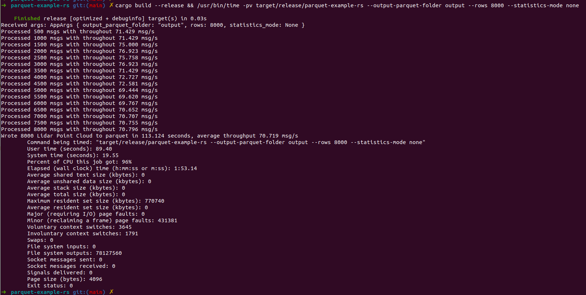
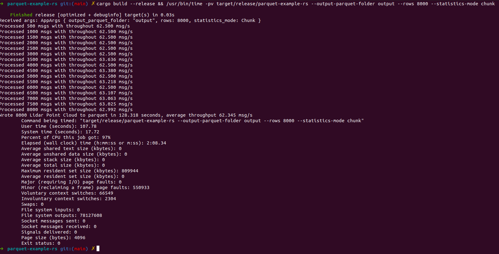
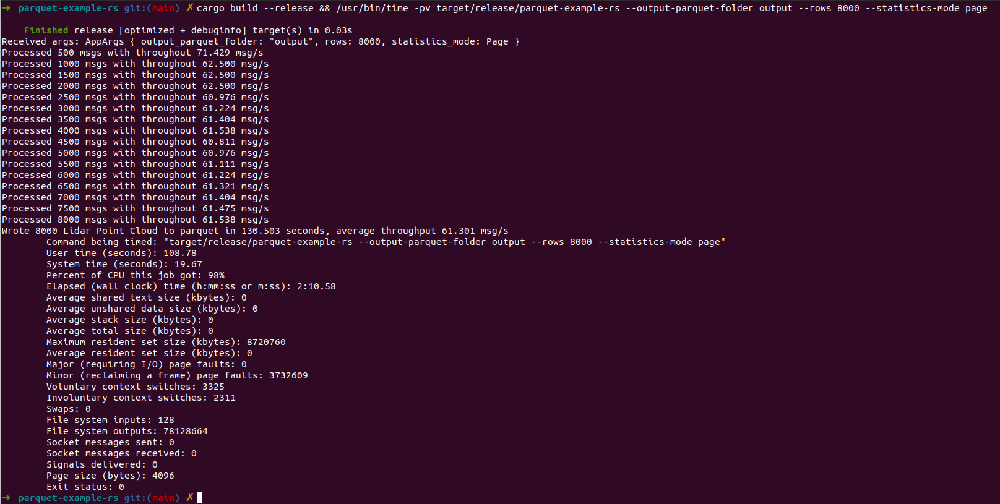

Write Parquet in Rust using Apache Arrow
------

# Development

The project requires the following tools configured on your developer machine:

- Rust compiler and Cargo, check https://www.rust-lang.org/tools/install on how to install both

# How to run

In the root folder of the repository run the following

```bash
cargo build --release && target/release/parquet-example-rs --help
Usage: parquet-example-rs --output-parquet-folder <OUTPUT_PARQUET_FOLDER> --rows <ROWS> --statistics-mode <STATISTICS_MODE>

Options:
      --output-parquet-folder <OUTPUT_PARQUET_FOLDER>
          Output path to save Parquet file(s)

      --rows <ROWS>
          Number of rows to generate

      --statistics-mode <STATISTICS_MODE>
          Controls statistics for Parquet

          Possible values:
          - none:  Compute no statistics
          - chunk: Compute chunk-level statistics but not page-level
          - page:  Compute page-level and chunk-level statistics

  -h, --help
          Print help (see a summary with '-h')
```

# Page statistics consume 10x more memory when write 8000 rows

My environment and machine:

- Rust compiler: `rustc 1.73.0 (cc66ad468 2023-10-03)`
- Cargo: `cargo 1.73.0 (9c4383fb5 2023-08-26)`
- OS: Ubuntu 20.04.6 LTS, 5.15.0-76-generic #83~20.04.1-Ubuntu SMP Wed Jun 21 20:23:31 UTC 2023 x86_64 x86_64 x86_64
  GNU/Linux
- CPU: 12th Gen Intel® Core™ i7-12800H × 20
- RAM: 64 Gbytes, Kingston 2 x 32 Gbytes DDR5-4800 CL40 SDRAM
- SSD: Samsung SSD 970 EVO Plus 2TB
- Laptop: ThinkPad P1 Gen 5

| Statistics mode | Number of rows | Total time, seconds | CPU usage, % | Average throughput, rows/s | Maximum resident set size, Mbytes |
|-----------------|----------------|---------------------|--------------|----------------------------|-----------------------------------|
| None            | 100            | 2.171               | 97           | 46.062                     | 648.51                            |
| None            | 500            | 7.089               | 94           | 83.333                     | 674.40                            |
| None            | 1000           | 14.003              | 94           | 83.333                     | 682.19                            |
| None            | 2000           | 27.557              | 96           | 72.557                     | 720.50                            |
| None            | 4000           | 55.373              | 95           | 72.237                     | 720.77                            |
| None            | 8000           | 113.124             | 96           | 70.719                     | 752.67                            |
| Chunk           | 100            | 1.846               | 97           | 54.171                     | 648.56                            |
| Chunk           | 500            | 8.456               | 96           | 59.130                     | 684.84                            |
| Chunk           | 1000           | 16.740              | 97           | 59.737                     | 700.51                            |
| Chunk           | 2000           | 32.734              | 97           | 61.099                     | 707.89                            |
| Chunk           | 4000           | 63.653              | 99           | 62.841                     | 708.05                            |
| Chunk           | 8000           | 128.318             | 97           | 62.345                     | 790.96                            |
| Page            | 100            | 1.970               | 99           | 50.761                     | 650.05                            |
| Page            | 500            | 8.676               | 97           | 57.630                     | 1030.73                           |
| Page            | 1000           | 17.070              | 98           | 58.582                     | 1506.09                           |
| Page            | 2000           | 34.656              | 96           | 57.710                     | 2902.50                           |
| Page            | 4000           | 68.332              | 98           | 58.538                     | 4661.50                           |
| Page            | 8000           | 130.53              | 98           | 61.301                     | 8516.36                           |

## Statistics mode: none

```bash
cargo build --release && /usr/bin/time -pv target/release/parquet-example-rs --output-parquet-folder output --rows 8000 --statistics-mode none
```



## Statistics mode: chunk

```bash
cargo build --release && /usr/bin/time -pv target/release/parquet-example-rs --output-parquet-folder output --rows 8000 --statistics-mode chunk
```



## Statistics mode: page

```bash
cargo build --release && /usr/bin/time -pv target/release/parquet-example-rs --output-parquet-folder output --rows 8000 --statistics-mode page
```



# Memory profiler

## Page

```bash
➜  parquet-example-rs git:(main) ✗ cargo run --features dhat-heap -- --output-parquet-folder output --rows 1000 --statistics-mode page

    Finished dev [unoptimized + debuginfo] target(s) in 0.03s
     Running `target/debug/parquet-example-rs --output-parquet-folder output --rows 1000 --statistics-mode page`
Received args: AppArgs { output_parquet_folder: "output", rows: 1000, statistics_mode: Page }
Processed 500 msgs with throughout 3.571 msg/s
Processed 1000 msgs with throughout 3.610 msg/s
Wrote 1000 Lidar Point Cloud to parquet in 277.533 seconds, average throughput 3.603 msg/s
dhat: Total:     89,243,445,590 bytes in 131,126 blocks
dhat: At t-gmax: 633,170,308 bytes in 6,748 blocks
dhat: At t-end:  2,503 bytes in 19 blocks
dhat: The data has been saved to dhat-heap.json, and is viewable with dhat/dh_view.html
```

## None

```bash
➜  parquet-example-rs git:(main) ✗ cargo run --features dhat-heap -- --output-parquet-folder output --rows 1000 --statistics-mode none

    Finished dev [unoptimized + debuginfo] target(s) in 0.03s
     Running `target/debug/parquet-example-rs --output-parquet-folder output --rows 1000 --statistics-mode none`
Received args: AppArgs { output_parquet_folder: "output", rows: 1000, statistics_mode: None }
Processed 500 msgs with throughout 4.762 msg/s
Processed 1000 msgs with throughout 4.785 msg/s
Wrote 1000 Lidar Point Cloud to parquet in 209.267 seconds, average throughput 4.779 msg/s
dhat: Total:     89,242,936,120 bytes in 108,223 blocks
dhat: At t-gmax: 632,963,508 bytes in 1,438 blocks
dhat: At t-end:  2,503 bytes in 19 blocks
dhat: The data has been saved to dhat-heap.json, and is viewable with dhat/dh_view.html
```